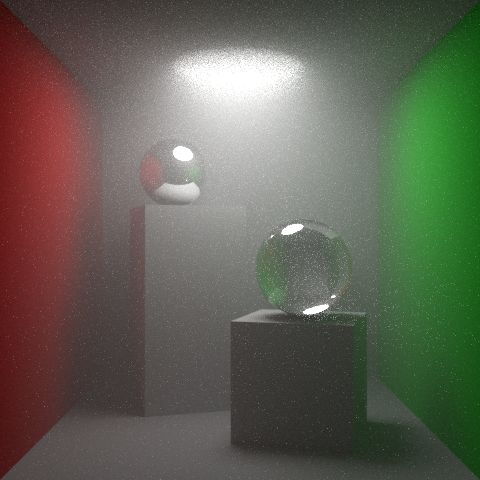

# CS 148

Introduction to Computer Graphics and Imaging, Fall 2022

---

- hw3: Ray Tracing, Shadow Ray, Spurious Self-Occlusion, Blinn-Phong Shading (diffuse + specular), Ambient Light, Recursion and Reflection, Fresnel Equations, Transmission   

- hw5: Area Light, Sampling, Global Illumination   

- hw6: Depth of Field, Volumetrics   

